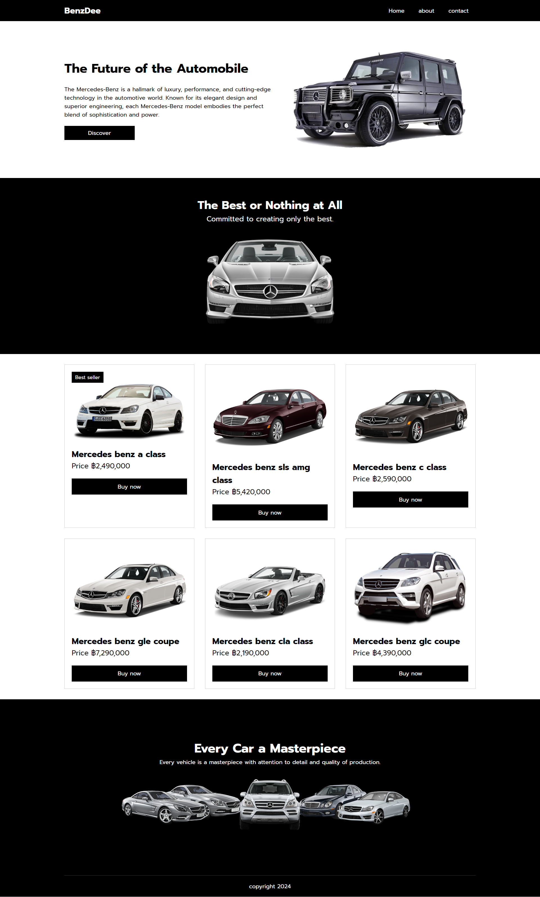

# Project Title : BenzDee
## Description
This project focuses on showcasing Mercedes-Benz cars available for sale.
## Features
- Responsive website ( Phone , Computer).
- When hovering over the "Discover" button in the banner section, the background color, text color, and border should change.
- When hovering over the "Buy Now" button in the product section, the background color, text color, and border should change.
- Clicking on a product image should enlarge it within the product section.
## Installation 
1. Navigate ot the project directory:

``` bash
cd project-name
```
2. Clone the repesitory:

``` bash 
git clone  https://github.com/permpptStudio/BenzDee
```

## Usage
to open the app, simply open  index.html in your browser.

## Techologies used
This project was built using the following technologies:
- html
- css ( with Flexbox and Grid)

## Screenshots

## link
[BenzDee](https://sage-cuchufli-2fbbd7.netlify.app/)
## Credit
Course html css masterful (Patiphan Phengpao)
